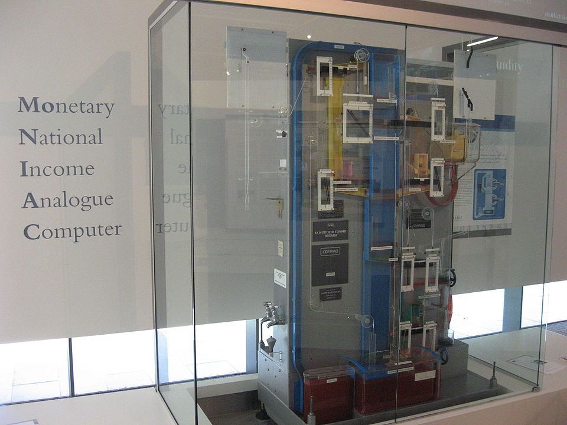

# Glooper

Glooper is an economic financial simulation environment that enables researchers to set up and run economic scenarios and analyze the flow of money down to individual transactions. Every transaction is verified using double-entry book keeping principles and audits ensure a zero balance between equity, assets, and liabilities.

## History

### Threadneedle

> "Threadneedle is a multi-agent simulation framework, based on a full double entry book keeping implementation of the banking system's fundamental transactions. It is designed to serve as an experimental test bed for economic simulations that can explore the banking system's influence on the macro-economy under varying assumptions for its regulatory framework, mix of financial instruments, and activities of borrowers and lenders. Support is provided for Basel Capital and central bank reserve regulatory frameworks, inter-bank lending and correct handling of loan defaults within the bank accounting framework."
>
> \- <https://arxiv.org/abs/1502.06163> \-

Glooper simply would not exist if it were not for the work on Threadneedle by Dr. Jacqueline Mallett.
Glooper follows the same principles in its core design and uses double-entry bookkeeping to provide a verifiable and traceable simulation.

### The name of the project

> "Otherwise referred to as the Thing in the Cellar, this is the Hex analogue, independently devised by Hubert Turvy to precisely replicate the circulation of money in Ankh-Morpork, and then with the aid of Igor, made absolutely perfect."
>
> \- <https://wiki.lspace.org/mediawiki/Glooper> \-



## Installation

### Elixir

Install Erlang, Elixir as appropriate for your platform.

<https://elixir-lang.org/install.html#unix-and-unix-like>

### Dependencies

To be able to run IEx or scripts you will need to install dependencies and establish the Glooper database.

To install dependencies run

```bash
mix deps.get
```

### Database

This project uses SQLite for its database so no installation should be necessary.

To create the database and tables run

```bash
mix ecto.create
mix ecto.migrate
```

## Running Glooper

There are currently two ways of interacting with the Glooper environment, either by using IEx directly or creating scripts and running them with mix.

### IEx

To open the Glooper IEx in the console type in the following.

```bash
iex -S mix
```

You can run the supplied borrower example to see if everything works as expected.

```iex
{:ok, pid, sim} = Simulation.start_from_config(borrower_config)
Simulation.init(sim)
Simulation.eval(sim)
:sys.get_state(Simulation.get_agent_pid(sim, "royal_bank"))
```

This should print out the bank with the initial state for the borrower example available in `priv/examples/config/borrower.yaml`.

### Phoenix

The Glooper simulation environment includes a web server written in Phoenix.

To start your Phoenix server:

- Setup the project with `mix setup`
- Start Phoenix endpoint with `mix phx.server`

Now you can visit [`localhost:4000`](http://localhost:4000) from your browser.

### Documentation

To view the Glooper API documentation:

- Compile the docs with `mix docs`
- To view the docs open `doc/index.html` in your browser

## Further reading

Ready to run in production? Please [check our deployment guides](https://hexdocs.pm/phoenix/deployment.html).

## Learn more

- Official website: <https://www.phoenixframework.org/>
- Guides: <https://hexdocs.pm/phoenix/overview.html>
- Docs: <https://hexdocs.pm/phoenix>
- Forum: <https://elixirforum.com/c/phoenix-forum>
- Source: <https://github.com/phoenixframework/phoenix>

